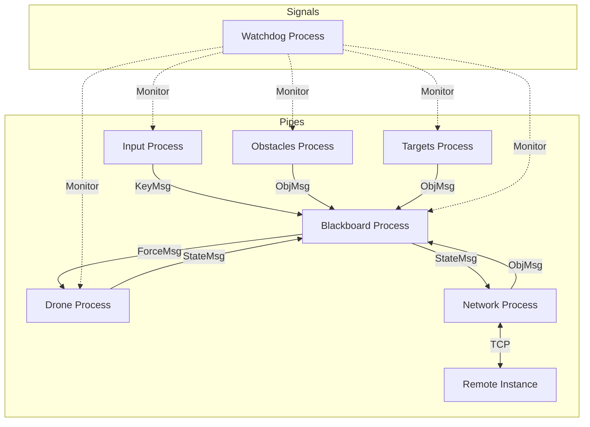

# ARP Assignment - Drone Simulation

This project implements a multi-process simulation of a drone moving in a 2D space with 2 degrees of freedom (horizontal and vertical), influenced by user inputs, obstacles and targets. The system is built in C and uses **pipes** for data exchange and **signals** for process monitoring. The user interface is built using `ncurses`.

## Project Structure

The project consists of several independent processes managed by a master process:

*   **`main`**: The entry point. Spawns all child processes, creates pipes, and manages the system shutdown.
*   **`watchdog`**: Monitors the health of all other processes. It receives heartbeats signals, logs activity, and triggers a system-wide shutdown if any process becomes unresponsive.
*   **`drone`**: Simulates the physics and dynamics of the drone. It receives forces and updates its position and velocity.
*   **`input`**: Captures keyboard input from the user to control the drone.
*   **`blackboard`**: The central hub and visualization window. It receives data from other processes, computes repulsive forces, and displays the simulation state.
*   **`obstacles`**: Generates static obstacles in random positions.
*   **`targets`**: Generates static targets in random positions.
*   **`network`**: Handles TCP communication (Server/Client) for the multiplayer mode. It exchanges drone coordinates with the remote peer.

### Directory Structure
*   `src/`: Source code modules.
*   `include/`: Header files (`common.h`, `logger.h`).
*   `logs/`: Runtime log files.
*   `bin/`: Compiled executables.
*   `build/`: Object files.

## Prerequisites

*   GCC compiler
*   `ncurses` library (libncurses)
*   `konsole` (used for spawning separate terminal windows)

## Build Instructions

To build the project, run `make` in the root directory:

```bash
make
```

This will compile all components and generate the executables in the `bin/` directory.

To clean the build artifacts, run:

```bash
make clean
```

## Usage

To start the simulation, run the `main` executable:

```bash
./main
```

This will:
1.  Start the **Watchdog** process in the background.
2.  Open separate `konsole` windows for the **Input Controller** and **Blackboard**.
3.  Initialize the Drone, Obstacles, and Targets processes.

### Controls

Focus on the **Input Controller** window to control the drone.

*   **Movement (Force application):**
    *   `i`: Up
    *   `k`: Down
    *   `j`: Left
    *   `l`: Right
    *   `u`: Up-Left
    *   `o`: Up-Right
    *   `n`: Down-Left
    *   `,`: Down-Right
*   **Commands:**
    *   `b`: Brake (stops the drone)
    *   `r`: Reset (resets drone position to center)
    *   `q`: Quit the simulation

### Visualization

The **Blackboard** window displays the simulation map:

*   `+`: Drone position
*   `O`: Obstacles
*   `*`: Targets
*   Repulsive forces from walls and obstacles affect the drone's trajectory.

## Architecture & Data Flow

The system uses a hybrid communication model:
1.  **Pipes**: Used for data flow (Controls, Telemetry, Object positions).
2.  **Signals (SIGUSR1)**: Used for the Watchdog mechanism (Heartbeats).



### Watchdog System
The `watchdog` process verifies that all critical processes are alive and responsive.
*   Each process sends a **Signal** (SIGUSR1) to the watchdog periodically.
*   The signal payload contains the Process ID and the current "Code Area" it is executing.
*   If the watchdog does not receive a signal from a process within `TIMEOUT_THRESHOLD`, it logs an alert and signals `main` to terminate the entire simulation.

## Logging

The system implements a centralized logging mechanism in `src/logger.c`. Logs are stored in the `logs/` directory:

*   **`processes.log`**: Registration of all started processes (Name, PID, Start Time).
*   **`watchdog.log`**: Specific logs from the watchdog process.
*   **`system.log`**: Critical system errors and shutdown events.
*   **`LogFile1`**: Detailed operational logs from the Watchdog (heartbeats, checks).
*   **`LogFile2`**: (Reserved for general process logging).
*   **`drone.log` / `input.log`**: Process-specific log files.

The logging system uses file locking (`flock`) to ensure thread-safe writing from multiple concurrent processes.

## System Evolution & Improvements

This version of the project introduces significant architectural shifts compared to previous iterations, moving from a simple functional simulation to a robust, self-monitored system.

1.  **Architecture: Closed-Loop Monitoring**
    *   **Previous**: The system was an "open loop" pipeline. Processes executed independently without supervision; if a component acted as a zombie or froze, the system continued indefinitely.
    *   **Current**: Use of a **Watchdog** creates a closed control loop. The system actively observes its own health, ensuring that a failure in one component triggers a safe, coordinated shutdown of the entire array.

2.  **Communication: Hybrid Model**
    *   **Previous**: Relied strictly on pipes for all interactions, potentially mixing high-volume data (telemetry) with critical control signals.
    *   **Current**: **Separation of Concerns**.
        *   **Pipes** are dedicated exclusively to data flow (positions, keypresses).
        *   **Signals (SIGUSR1)** are dedicated to the control plane (monitoring), ensuring that health checks can still succeed even if data pipes are saturated.

3.  **Observability & Concurrency**
    *   **Previous**: Ad-hoc logging to individual text files with no synchronization.
    *   **Current**: **Centralized, Thread-Safe Logging**. The new `logger` module uses file locking (`flock`) to prevent race conditions when multiple processes write to the same log file simultaneously. Logs are now structured by purpose (Lifecycle, Health, Errors) rather than just by origin.
  
## Corrections from assignment 1

Following the corrections and feedback provided by the professor on Assignment 1, the wall–repulsion logic has been revised.
In the previous implementation, the repulsive force generated by the walls caused the drone to bounce back upon collision. This behavior has been modified to better reflect a more realistic and controlled interaction with the environment.

In the current version, when the drone reaches a wall, the repulsive logic prevents further penetration by nullifying the velocity component directed toward the wall. As a result, the drone stops against the wall instead of rebounding, ensuring a more stable and predictable behavior consistent with the updated project requirements.

# Network Implementation

## Architecture
The networked mode extends the single-process architecture by introducing a dedicated **Network Process**. This process acts as a bridge between the local simulation (Blackboard) and the remote instance via TCP sockets.

### Components
1.  **Network Process (`src/network.c`)**:
    -   Manages the TCP socket connection (Server or Client).
    -   Maintains a persistent connection with the remote peer.
    -   Implements a custom application-level protocol for state synchronization.
    -   Communicates with the local **Blackboard** via two dedicated pipes:
        -   `BtoN` (Blackboard to Network): Sends local drone telemetry.
        -   `NtoB` (Network to Blackboard): Receives remote object data (to be displayed as obstacles).

2.  **Blackboard Integration**:
    -   The Blackboard has been updated to read from the Network pipe (`NtoB`) and render received data as "remote obstacles" (simulating the other player's drone).

## Protocol Details
The system uses a custom, synchronous, state-machine-based text protocol over TCP.

### 1. Handshake Phase
Before the simulation loop begins, the two instances synchronize configuration.
1.  **Connection**: Client connects to Server IP/Port.
2.  **Ack**: 
    -   Server sends: `ok`
    -   Client responds: `ook`
3.  **Dimension Sync**:
    -   Server sends: `size <width> <height>`
    -   Client receives and sends acknowledgement: `sok <width> <height>`

### 2. Synchronization Loop
Once the handshake is complete, the Server initiates a continuous loop to exchange positions. The cycle is strictly sequential to ensure data consistency.

**Cycle Steps:**
1.  **Server sends Drone Data**:
    -   Server sends command: `drone`
    -   Server sends payload: `<server_x> <server_y>` (Server's drone position)
2.  **Client Acknowledgement**:
    -   Client receives data, updates its valid remote state.
    -   Client echoes back: `dok <received_x> <received_y>`
3.  **Server requests Obstacle Data** (Client's Drone):
    -   Server sends command: `obst`
4.  **Client sends Data**:
    -   Client sends payload: `<client_x> <client_y>` (Client's drone position)
5.  **Server Acknowledgement**:
    -   Server receives data, updates its valid remote state.
    -   Server echoes back: `pok <received_x> <received_y>`

This loop repeats indefinitely until one side terminates the connection (sends `q`).

## Manual Verification

To verify the correct functionality, you will need to run two instances of the program.

### Step 1: Start the Server (Instance A)
1. Open a terminal.
2. Run the executable: `./bin/main`
3. Select **2. Networked**.
4. Select **1. Server**.
5. Enter a port (e.g., `5000`).
6. Enter dimensions (e.g., `80 24`).
7. Wait for the client to connect.

### Step 2: Start the Client (Instance B)
1. Open a second terminal.
2. Run the executable: `./bin/main`
3. Select **2. Networked**.
4. Select **2. Client**.
5. Enter the IP address `127.0.0.1` (localhost).
6. Enter the same port (`5000`).

### Step 3: Observations
- **Drone A** (Server) movement should be visible in its own window.
- **Drone A** should appear as an obstacle (X) in the **Client** window.
- **Drone B** (Client) movement should be visible in its own window.
- **Drone B** should appear as an obstacle (X) in the **Server** window.

### Step 4: Watchdog Check
- Check the terminal output or `logs/LogFile1.log`.
- You should see "Process Network executing Area..." logs.

## IP Address Note

The Client should use **127.0.0.1** (localhost) if you are running both the Server and Client on the same computer.

If you are running them on **two separate computers** (A and B):
1. On Computer A (Server), find the local IP address by running `ip addr` or `hostname -I` in a terminal.
2. On Computer B (Client), enter that IP address (e.g., `192.168.1.X`) when prompted.

## Group Test
This project was tested with the group **samu_luca** on the 15th of January in Prof. Zaccaria's lab.

## Exam Date
Both of the students of this group have taken the exame on the 13th of January 2026.